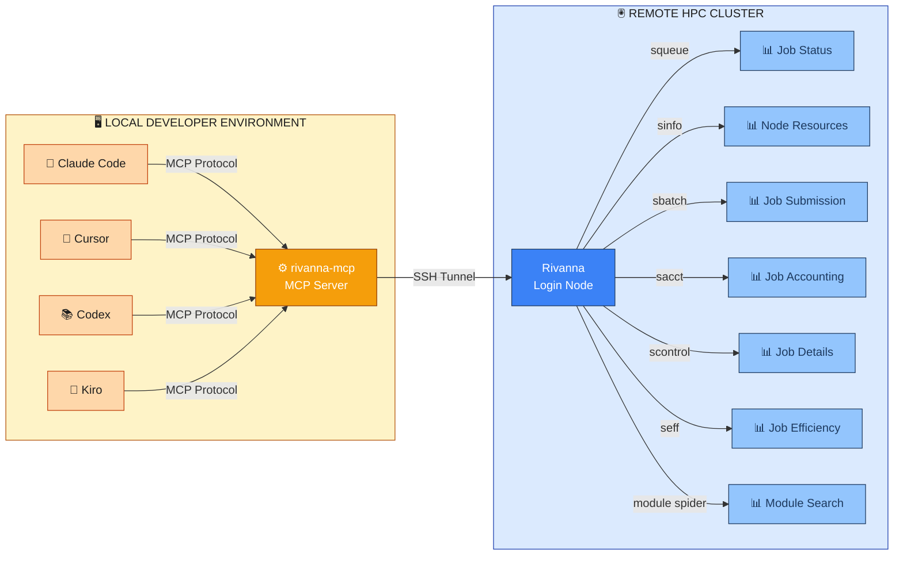

# Rivanna MCP


A local MCP (Model Context Protocol) server for querying Rivanna HPC cluster metrics and job information via SLURM. Integrates seamlessly with your development environment to give AI access to the Rivanna cluster status, your jobs, resources, and allocations.

> **What is MCP?**
> MCP (Model Context Protocol) is an open standard that allows AI assistants to securely access tools and data from external systems. This MCP server acts as a bridge, giving Claude Code and other AI tools direct access to Rivanna cluster commands and information. To learn more about MCP, see [**this video**](https://www.youtube.com/watch?v=pvxNcQTcIy4) from Tim Berglund.

Some things you can do with this MCP:

- What are my current jobs in Rivanna?
- Stop my job ID 1234567890.
- How much storage have I used in Rivanna?
- How many cores total are in Rivanna/Afton?
- How many GPUs are available in the cluster?
- Tell me about my allocations.
- Give me the job history for user `mst3k` over the past `N` days.
- Help me submit a job to Rivanna with specific resources.
- Run this command on the cluster: ls -al $HOME/projects
- Show me the 5 largest files in my home directory

## Architecture

### System Architecture Diagram



**How It Works:**

The MCP server acts as a bridge between your IDE and Rivanna:

1. **IDE Clients** (left): Claude Code, Cursor, Codex, Kiro, etc. connect via MCP Protocol
2. **MCP Server** (center): Receives queries and translates them to SLURM commands
3. **SSH Connection**: Securely tunnels to Rivanna's login node
4. **SLURM Commands**: Executes job queries and submissions on the cluster

The MCP server:
- Spawns native SSH processes for each command execution
- Parses SLURM command output into structured data
- Returns results via the MCP protocol

## The Fifteen Tools:

MCP servers offer "tools" to do specific tasks or communicate with external systems.
Unlike an API where your request must conform precisely to a resource, its method and
parameters, MCP tools are invoked by way of plain language requests from AI enabled
IDEs or agents.

The fifteen tools in the Rivanna MCP are:

1. **Cluster Overview** — Returns a comprehensive snapshot of the entire Rivanna cluster, including capacity, GPU availability, node status, and 24-hour trends.
2. **Cluster Usage (24h)** — Shows CPU and memory utilization trends for the past 24 hours rendered as colored ASCII graphics.
3. **Node Resources** — Lists available compute nodes and their current resource status, optionally filtered by partition.
4. **Storage Quota** — Reports filesystem quota usage across all mounted filesystems, with optional filtering by path.
5. **Directory Usage** — Returns disk usage for a specific directory on the cluster.
6. **Allocation Info** — Displays compute-hour allocation limits for a user or account.
7. **Job History** — Retrieves historical job accounting and compute-hour consumption over a configurable number of past days.
8. **Submit Job** — Creates and optionally submits a SLURM job script to Rivanna with configurable resources, module loading, and file transfer.
9. **List Jobs** — Queries the SLURM job queue and returns jobs filtered by state, user, or count limit.
10. **Cancel Job** — Cancels a running or pending SLURM job by ID, with optional signal selection.
11. **SSH Login** — Opens an interactive SSH session to Rivanna's login node using your configured credentials.
12. **Execute Command** — Runs an arbitrary shell command on Rivanna and returns its output directly to your IDE.
13. **Job Details** — Fetches full scheduling and resource information for a specific job via `scontrol`, including the pending reason, assigned nodes, time limits, and output paths.
14. **Job Efficiency** — Reports CPU and memory efficiency percentages for a completed job via `seff`, enabling resource right-sizing for future submissions.
15. **Search Modules** — Searches Rivanna's LMOD software stack via `module spider` and returns matching module names with all available versions.

Read more detail about each tool with examples below.

## Installation

### TL;DR

1. Be sure you have Node and `npm` installed.
2. Set up SSH key authentication to Rivanna.
3. Install the MCP using [this command](claude mcp add rivanna-mcp -- node /Users/nem2p/Development/rivanna-mcp/src/cli.js) (you must install it once and reinitialize for each project)
4. Run the setup command.
5. You're ready to interact with Rivanna through your AI tools!

### Prerequisites

- Install [`node`](https://nodejs.org/en/download) and `npm` on your system. In Rivanna you can load this as a module.
- Have an active Rivanna HPC account and allocation.
- Generate an **SSH key pair** and add it to `~/.ssh/authorized_keys` in your Rivanna home directory
- Establish **UVA network access**: Be on a campus network or VPN connection for remote access

### Install for Your Client

First, install globally and run the setup:
```bash
npm install -g github:uvads/rivanna-mcp && rivanna-mcp setup
```

Then choose your client below. Install the MCP again in separate projects:

#### Claude Code
```bash
claude mcp add rivanna-mcp -- rivanna-mcp
```

#### Codex
Add to your Codex configuration file (typically `~/.codex/config.json` or via Codex settings):
```json
{
  "mcpServers": {
    "rivanna-mcp": {
      "command": "rivanna-mcp",
      "args": []
    }
  }
}
```

#### Cursor
Add to `.cursor/settings.json` in your project directory:
```json
{
  "mcpServers": {
    "rivanna-mcp": {
      "command": "rivanna-mcp",
      "args": []
    }
  }
}
```

#### Kiro
Add to your Kiro configuration (via Kiro settings or `~/.kiro/config.json`):
```json
{
  "mcpServers": {
    "rivanna-mcp": {
      "command": "rivanna-mcp",
      "args": []
    }
  }
}
```

## Quick Start

### 1. Run the Setup Wizard

After installation, configure your Rivanna connection:

```bash
rivanna-mcp setup
```

You'll be prompted for:
- **Environment**: Are you working remotely or on a Rivanna compute node?
- **Computing ID**: Your Rivanna username (e.g., `mst3k`).
- **SSH Key Path** (remote only): Path to your SSH private key (e.g., `~/.ssh/my_key_rivanna`)
- **SLURM Jobs Path**: Folder name in your Rivanna `$HOME` for SLURM job directories (default: `rivanna-jobs`).
- **Logging**: Would you like your MCP history saved to `~/.rivanna-mcp/history.log`.
- **SLURM Job Mode**: Basic (guided `rivanna.yaml` workflow) or Advanced (custom `submit.slurm` template).
- **YAML Confirmation Gate**: Require explicit approval of `rivanna.yaml` before every job submission (recommended, default: yes).
- **Default Allocation**: Select your default allocation for SLURM submissions.

The wizard will test your SSH connection and save your configuration to `~/.rivanna-mcp/config.json`.

### 2. Set Your SLURM Defaults (Optional but Recommended)

To streamline job submissions, configure your preferred SLURM parameters (allocation, partition, CPU count, memory, etc.):

```bash
rivanna-mcp slurm-defaults
```

This interactive setup will guide you through:
- **Allocation**: Which account to charge compute hours against.
- **Partition**: Your preferred SLURM queue (standard, gpu, parallel, largemem).
- **CPUs**: Default number of CPU cores.
- **Memory**: Default memory allocation.
- **Wall-Clock Time**: Default job timeout.
- **Nodes/GPUs**: Defaults for parallel or GPU jobs (if applicable).

(SLURM Jobs Path and SLURM Job Mode are configured once during `rivanna-mcp setup`, not here — see [Run the Setup Wizard](#1-run-the-setup-wizard).)

Your preferences are saved to `~/.rivanna-mcp/slurm-defaults.json` and will be used by:
- **Claude Code**: When using the `submit_job` tool.
- **Any other tools**: That reference your SLURM preferences.
- **Future CLI commands**: Any other tools you build on top of rivanna-mcp.

You can always update your preferences by running the command again.

### 3. Configure in your IDE

You have two options for integrating `rivanna-mcp` with a tool like Claude Code:

#### Option A: Manual Server Management (Simple)

Start the server in a terminal before using Claude Code:

```bash
rivanna-mcp
```

The server will listen for MCP protocol requests from Claude Code. Keep this terminal running separately while you work.

#### Option B: Automatic Server Management (Recommended)

Configure `rivanna-mcp` in your project's `.claude/settings.json` to auto-start it:

**For globally installed rivanna-mcp:**

Create or edit `.claude/settings.json` in your project root:

```json
{
  "mcpServers": {
    "rivanna-mcp": {
      "command": "rivanna-mcp",
      "args": []
    }
  }
}
```

**For locally installed rivanna-mcp (in the project):**
```json
{
  "mcpServers": {
    "rivanna-mcp": {
      "command": "node",
      "args": ["/path/to/rivanna-mcp/src/index.js"]
    }
  }
}
```

Replace `/path/to/rivanna-mcp` with the actual path to your rivanna-mcp directory (use absolute paths or `${PROJECT_ROOT}` for relative paths).

**About the `args` field:**
- The `"args": []` should remain empty. `rivanna-mcp` doesn't accept command-line arguments
- All configuration is read from `~/.rivanna-mcp/config.json` created by the setup wizard
- If you need to reconfigure, just run `rivanna-mcp setup` again

With this configuration, Claude Code will automatically start the MCP server when needed and manage its lifecycle.

Claude Code will now:
- Automatically start the `rivanna-mcp` server when you begin a session
- Manage the server lifecycle (no manual terminal needed)
- Provide access to all HPC tools in your prompts

**Benefits:**
- One less terminal to manage
- Server starts automatically with your project
- Cleaner workflow within Claude Code

### 4. Use in your Development Environment

Once configured (either running manually or via settings.json), you'll have access to HPC tools for monitoring, submitting, and managing jobs on your Rivanna cluster directly from your IDE queries and prompts.

## Available Tools

### Cluster Overview
Get a comprehensive snapshot of the entire Rivanna cluster including capacity usage, GPU availability, node status, and 24-hour trends.

**Parameters:**
None

**Example Prompts:**
- "Give me a full overview of the Rivanna cluster"
- "What's the current state of the cluster?"
- "Show me cluster capacity, GPU types, and 24-hour trends"

### Cluster Usage (24h)
Get cluster CPU and memory usage trends for the last 24 hours with colored ASCII graphics.

**Parameters:**
None

**Example Prompts:**
- "What's the cluster utilization looking like?"
- "Show me the cluster usage trends for the last 24 hours"
- "Is the cluster busy right now?"

### Node Resources
Get available compute nodes and their resource status.

**Parameters:**
- `partition` (string, optional): Filter by partition name (e.g., `gpu`, `standard`)
- `detailed` (boolean, optional): Include detailed per-node information and cluster summary (default: false)

**Example Prompts:**
- "How many GPU nodes are available?"
- "Show me detailed resource info for the standard partition"
- "What's the status of compute nodes in the gpu partition?"

### Storage Quota
Check filesystem quotas across all mounted filesystems.

**Parameters:**
- `filesystem` (string, optional): Filter by filesystem path (e.g., `/home`, `/scratch`)

**Example Prompts:**
- "How much storage am I using?"
- "Check my quota on the home filesystem"
- "Show me disk usage across all filesystems"

### Directory Usage
Get disk usage for a specific directory.

**Parameters:**
- `path` (string, optional): Directory path to check (default: current directory)

**Example Prompts:**
- "How much space is my data directory using?"
- "Show me the largest files in my home directory"
- "What's the disk usage in my scratch folder?"

### Allocation Info
View resource allocation limits for users and accounts.

**Parameters:**
- `user` (string, optional): Filter by username

**Example Prompts:**
- "What are my allocation limits?"
- "Tell me about my compute hour budget"
- "Show allocation info for user mst3k"

### Job History
Get historical job accounting and compute hour usage over a time period.

**Parameters:**
- `user` (string, optional): Filter by username
- `days` (number, optional): Number of days to look back (default: 30)

**Example Prompts:**
- "How many compute hours have I used this month?"
- "Show me my job history for the last 60 days"
- "What's my historical job accounting?"

### Submit Job
Create and optionally submit a SLURM job file to Rivanna with configurable resources and automatic module loading.

**Default Values (presented for user confirmation):**
- `jobName`: Generated from project folder name + 6 random alphanumeric chars (e.g., `"rivanna-work-1a2b3c"`)
- `partition`: From your saved preferences (set via `rivanna-mcp slurm-defaults`), or `"standard"` if not configured
- `cpus`: From your saved preferences, or `4` if not configured
- `memory`: From your saved preferences, or `"16GB"` if not configured
- `time`: From your saved preferences, or `"01:00:00"` (1 hour) if not configured
- `allocation`: From your saved preferences (required)
- `submit`: `true` (submit immediately)

**Note:** If you haven't configured your SLURM defaults yet, the tool will warn you and suggest running `rivanna-mcp slurm-defaults` to set them up.

**Parameters:**
- `jobName` (string, optional): Name for the job (alphanumeric, underscores/hyphens OK)
- `allocation` (string, optional): Account/allocation to charge compute hours to (uses config default if not provided)
- `partition` (string, optional): Partition to submit to (`gpu`, `parallel`, `standard`, `largemem`)
- `cpus` (integer, optional): Number of CPU cores to request
- `memory` (string, optional): Memory to request (e.g., `"16GB"`, `"32GB"`, `"64GB"`)
- `time` (string, optional): Walltime limit in HH:MM:SS format (e.g., `"01:00:00"`)
- `nodes` (integer, optional): Number of compute nodes (default: 1)
- `gpus` (string, optional): Number of GPUs per node (only for gpu partition)
- `outputPath` (string, optional): Path for stdout output file (default: job directory)
- `errorPath` (string, optional): Path for stderr output file (default: job directory)
- `scriptContent` (string, optional): Shell commands to execute in the job
- `language` (string, optional): Programming environment: `"python"` (miniforge), `"r"` (with goolf), or `"none"` (default: `"python"`)
- `moduleVersion` (string, optional): Specific module version (e.g., `"py310"`, `"py311"` for Python)
- `filesToTransfer` (array, optional): List of local file paths to copy to the job directory (e.g., `["./script.py", "./data.csv"]`)
- `submit` (boolean, optional): Whether to submit immediately (default: true)

**Job Organization:**

Each job submission creates its own directory (`~/rivanna-jobs/jobname_timestamp/`) containing:
- The SLURM script
- Job output and error logs (using SLURM's `%j` for the job ID)
- Any supporting files (keeps `$HOME` clean)

**Auto-Detection of Project Files:**

The tool automatically detects and copies language-specific files from your project:

**Python projects:**
- All Python files (`*.py`) in your current directory
- `Pipfile` or `requirements.txt` if present

**R projects:**
- All R files (`*.R` or `*.r`) in your current directory
- `renv.lock` (R environment snapshot) or `DESCRIPTION` (R package metadata) if present

This keeps your job directory self-contained with all code and dependencies for execution on Rivanna.

**Dependency Management:**

**Python (`language: "python"):**
- If a `Pipfile` exists: Automatically converts it to `requirements.txt` in the job script and installs dependencies via `pip`
- If a `requirements.txt` exists: Automatically copies it and installs dependencies via `pip`

**R (`language: "r"):**
- If `renv.lock` exists: Automatically restores the R environment using `renv::restore()`
- If `DESCRIPTION` exists: Automatically installs package dependencies using `devtools::install_deps()`

Dependencies are installed during job startup, before your job script runs.

**File Transfer:**

Use `filesToTransfer` to upload additional local files (data, configs) to the job directory:
```
"filesToTransfer": ["./input_data.csv", "./config.json"]
```
Files are transferred over SSH to `login.hpc.virginia.edu` and placed in the job directory. In your job script, reference them by filename (e.g., `python my_script.py input_data.csv`).

**Module System:**

The tool automatically loads the appropriate Rivanna modules:
- **Python** (default): Loads `module load miniforge` with Python 3.12 by default. Use `moduleVersion` for other versions (e.g., `"py310"`, `"py311"`)
- **R**: Loads `module load goolf R` (goolf is required as a dependency). Use `module spider R` on Rivanna to discover available R versions
- **None**: Skips module loading for custom environments

**Usage in Claude Code:**

Claude Code can guide you through job creation interactively. Just ask:

```
I want to submit a Python job to Rivanna that processes data
```

Claude will interview you for the required parameters, recommend appropriate modules, and optionally submit the job.

**Example workflow:**
1. Claude asks about your allocation, partition, resource needs, and language preference
2. You provide answers
3. Claude creates the SLURM script with appropriate module loading
4. You can review it or let Claude submit it
5. Your job files are organized in a dedicated directory

### List Jobs
Query the SLURM job queue and list all jobs with flexible filtering.

**Parameters:**
- `state` (string, optional): Filter by job state: `all`, `RUNNING`, `PENDING`, `COMPLETED`, `FAILED`, `CANCELLED` (default: `all`)
- `user` (string, optional): Filter by username
- `limit` (number, optional): Maximum number of jobs to return (default: 100)

**Example Prompts:**
- "Show me my running jobs"
- "What jobs have failed?"
- "How many pending jobs do I have?"

### Cancel Job
Cancel a running or pending SLURM job by ID.

**Parameters:**
- `jobId` (string, required): The SLURM job ID to cancel (get from `list_jobs` tool)
- `signal` (string, optional): Signal to send: `SIGTERM` (graceful, default), `SIGKILL` (force), or other UNIX signal

**Example Prompts:**
- "Cancel job 1234567"
- "Kill job 1234567 with SIGKILL"
- "Stop my running job"

### SSH Login
Open an interactive SSH session directly to Rivanna's login node using your configured credentials and SSH key.

**Parameters:**
None

**Example Prompts:**
- "Connect me to Rivanna"
- "Open an SSH session to the login node"
- "Let me SSH into Rivanna"

### Execute Command
Execute arbitrary shell commands directly on Rivanna and get the output back to your IDE.

**Parameters:**
- `command` (string, required): The shell command to execute (e.g., `"ls -al /home/mst3k/projects/"`)

**Example Prompts:**
- "Run this command on the cluster: `ls -al $HOME/projects`"
- "Show me the 5 largest files in my home directory"
- "Execute: `du -sh /scratch/mst3k/* | sort -h`"

### Job Details
Get full scheduling and resource information for a specific job using `scontrol show job`.

**Parameters:**
- `jobId` (string, required): The SLURM job ID to inspect (obtain from `list_jobs`)

**Returns:** job name, state, pending reason, assigned node list, CPU/memory allocation, time limit vs elapsed, submit/start/end times, working directory, stdout/stderr paths, exit code, QOS, and dependency chain.

**Example Prompts:**
- "Why is job 1234567 still pending?"
- "Show me the full details for job 1234567"
- "Which nodes is job 1234567 running on?"
- "What's the working directory for job 1234567?"

> **Tip:** The `reason` field directly answers "why is my job stuck?" — common values are `Priority` (waiting its turn), `Resources` (not enough free nodes), `ReqNodeNotAvail` (requested nodes are down), and `AssocGrpCPURunMinutesLimit` (allocation budget exhausted).

### Job Efficiency
Get CPU and memory efficiency statistics for a completed job using `seff`.

**Parameters:**
- `jobId` (string, required): The SLURM job ID to check (obtain from `list_jobs` or `get_job_history`)

**Returns:** CPU efficiency percentage, memory efficiency percentage, wall-clock time, cores allocated, and final job state.

**Example Prompts:**
- "How efficiently did job 1234567 use its resources?"
- "Did job 1234567 over-request memory?"
- "Show me the CPU and memory efficiency for my last job"
- "Help me right-size the resources for my next submission based on job 1234567"

> **Tip:** Efficiency below ~50% on either CPU or memory means you requested roughly twice what you needed — future jobs will queue faster and consume fewer SUs with smaller requests.

### Search Modules
Search Rivanna's LMOD software stack for available modules and their versions using `module spider`.

**Parameters:**
- `query` (string, required): Module name or keyword to search for (e.g., `python`, `cuda`, `R`, `openmpi`)

**Returns:** Grouped list of matching modules, each with all available versions and a `latestFull` string ready to paste into `rivanna.yaml`.

**Example Prompts:**
- "What versions of CUDA are available on Rivanna?"
- "Search for Python modules"
- "Is PyTorch available as a module?"
- "Find the right module string for OpenMPI"
- "What R versions can I load?"

## Project Configuration with `rivanna.yaml`

`rivanna.yaml` is the **single source of truth** for every SLURM job submitted from a project. It lives at the project root and declares the full job environment — SLURM resource parameters, modules to load, environment setup commands, the job commands themselves, and which local files to upload. `submit_job` reads this file and produces a reproducible SLURM script; no interview required once the file exists.

### Auto-generating `rivanna.yaml`

If no `rivanna.yaml` exists when you call `submit_job`, the tool automatically:

1. **Scans your project directory** for language-specific files to detect the dominant language:
   - Nextflow: `*.nf`, `nextflow.config`
   - Snakemake: `Snakefile`, `*.smk`
   - Python: `*.py`, `requirements.txt`, `Pipfile`, `pyproject.toml`, `environment.yml`
   - R: `*.R`, `*.Rmd`, `renv.lock`, `DESCRIPTION`
   - Go: `*.go`, `go.mod`
   - Fortran: `*.f`, `*.f90`, `*.f95`, `*.f03`, `*.F90`, `*.for`, `*.ftn`, `mpif.h`
   - C/C++: `*.c`, `*.cpp`, `Makefile`, `CMakeLists.txt`
   - Julia: `*.jl`, `Project.toml`
   - Rust: `*.rs`, `Cargo.toml`
   - MATLAB: `*.m`
   - Java: `*.java`, `pom.xml`, `build.gradle`, `*.jar`
   - Perl: `*.pl`, `*.pm`
2. **Generates a tailored template** with the right modules, env setup commands, and file list pre-filled for that language
3. **Stops and asks you to review** — set your `account`, confirm modules and commands, then call `submit_job` again

### The `rivanna.yaml` format

```yaml
# rivanna.yaml — SLURM job specification for this project

job:
  name: my-job
  account: my-allocation      # required — use get_allocation_info to list yours
  partition: standard         # standard | gpu | parallel | largemem
  nodes: 1
  cpus: 4
  memory: 16GB
  time: "01:00:00"            # HH:MM:SS — job is killed when this expires
  # gpus: 1                   # uncomment for GPU jobs; also set partition: gpu

modules:
  - miniforge                 # load LMOD modules in this order
  # - cuda/12.4.0             # use search_modules to find exact version strings

env_setup:
  - pip install -r requirements.txt   # runs after module load, before commands

commands:
  - echo "Job started on $(hostname) at $(date)"
  - python train.py

files:
  - ./train.py                # local files to upload to the job directory
  - ./requirements.txt
```

### Value precedence

At submission time, values are resolved in this order (highest wins):

```
1. Explicit tool arguments (e.g., partition: "gpu" passed to submit_job)
2. rivanna.yaml job: section
3. ~/.rivanna-mcp/slurm-defaults.json  (set via `rivanna-mcp slurm-defaults`)
4. ~/.rivanna-mcp/config.json          (defaultAllocation, for job resolution)
5. Built-in fallbacks                  (partition: standard, cpus: 4, memory: 16GB)
```

### Source-of-authority rule

| File | Role | Written by |
|------|------|------------|
| `~/.rivanna-mcp/slurm-defaults.json` | User-wide defaults | `rivanna-mcp slurm-defaults` only |
| `<project>/rivanna.yaml` | Per-project job spec | Auto-generated + user edits |
| Generated `.slurm` script | What actually runs on the cluster | `submit_job` |

### Language-specific behavior

**Python** — loads `miniforge`; installs deps via `pip install -r requirements.txt`, `pipenv install`, or `conda env create` depending on what's present.

**R** — loads `goolf` + `R`; runs `renv::restore()` if `renv.lock` exists, or `devtools::install_deps()` if `DESCRIPTION` exists.

**Go** — loads a Go module; runs `go mod download` if `go.mod` is present, then builds with `go build`.

**Fortran** — loads `gcc/11.4.0` (includes `gfortran`); detects MPI usage from filenames (`*mpi*`, `mpif.h`) and adds `openmpi` + `mpirun` if found; builds with `make`, `cmake`, or a direct `gfortran` compile. Supports `.f`, `.f90`, `.f95`, `.f03`, `.F90`, `.for`, and `.ftn` extensions. Intel compiler (`ifort`) is offered as a commented alternative.

**C/C++** — loads `gcc`; builds with `make`, `cmake`, or a direct `gcc` compile depending on project files found.

**Julia** — loads a Julia module; runs `Pkg.instantiate()` if `Project.toml` exists.

**Rust** — no `cargo` or `rust` module available on Rivanna; bootstraps the toolchain at job runtime via `rustup`, then builds with `cargo build --release`.

**MATLAB** — loads `matlab`; runs the detected script with `matlab -nodisplay -nosplash`.

**Java** — loads `java/11.0.2`; detects pre-built JARs, Maven (`pom.xml`), or Gradle (`build.gradle`) and generates the appropriate compile/run commands. Sets `-Xmx` heap size from `$SLURM_MEM_PER_NODE` automatically. Includes commented examples for common bioinformatics tools (GATK, Picard).

**Nextflow** — loads `nextflow` + `singularity`; generates a `nextflow run` command with `-profile slurm` and sets `NXF_SINGULARITY_CACHEDIR` to scratch. Includes `-resume` and reporting flags as commented options.

**Snakemake** — loads `miniforge` and installs Snakemake; runs with `--cores $SLURM_CPUS_PER_TASK`. Includes commented options for `--use-conda`, `--use-singularity`, and SLURM executor plugin for per-rule job submission.

**Perl** — loads `perl`; includes commented BioPerl module and `cpanm` dependency install. Generates a `perl script.pl` run command from the detected main script.

## Troubleshooting

### "Configuration not found"

Run the setup wizard to create your configuration:

```bash
rivanna-mcp setup
```

### "SSH key not found" or "Permission denied"

1. Verify your SSH key exists:
   ```bash
   ls -la ~/.ssh/your-key-name
   ```

2. Ensure it has correct permissions (should be `600`):
   ```bash
   chmod 600 ~/.ssh/your-key-**name**
   ```

3. Test the connection manually:
   ```bash
   ssh -i ~/.ssh/your-key-name username@login.hpc.virginia.edu whoami
   ```

### Connection timeout

- Verify you're on the UVA network or connected to VPN
- Confirm your SSH key is authorized on Rivanna
- Check Rivanna's status: https://www.rc.virginia.edu
- Try the manual SSH command above to isolate the issue

### SLURM command errors

- Verify your computing ID is correct in the configuration
- Ensure SLURM tools (`squeue`, `sinfo`, etc.) are available on the cluster
- Check your Rivanna account status at the RC website

### Post-Quantum Algorithm Not Available

This is expected if Rivanna hasn't upgraded to support post-quantum algorithms yet. The client will automatically fall back to secure alternatives. No action needed.

## Security

This MCP server runs locally on your machine. No history or information about your interactions are stored outside of your local environment.

- **SSH Keys**: Only stored locally in your filesystem
- **Credentials**: Never transmitted outside SSH tunnels
- **Configuration**: Stored locally in `~/.rivanna-mcp/` (not in `git`)
- **Best Practice**: Use SSH key-based authentication with a strong passphrase

## License

MIT

## Support & Contributions

For issues, feature requests, or contributions:
https://github.com/uvads/rivanna-mcp/issues

## Uninstall

To completely uninstall `rivanna-mcp`:
                                         
1. Uninstall the global npm package:                                                   
    ```
    npm uninstall -g rivanna-mcp
    ```

1. Remove the configuration directory:                    

    ```
    rm -rf ~/.rivanna-mcp                             
    ```
