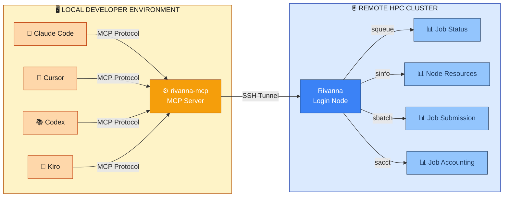

# Rivanna MCP

A local MCP (Model Context Protocol) server for querying Rivanna HPC cluster metrics and job information via SLURM. Integrates seamlessly with your development environment to give AI access to the Rivanna cluster status, your jobs, resources, and allocations.

> **What is MCP?**
> MCP (Model Context Protocol) is an open standard that allows AI assistants to securely access tools and data from external systems. This MCP server acts as a bridge, giving Claude Code and other AI tools direct access to Rivanna cluster commands and information. To learn more about MCP, see [**this video**](https://www.youtube.com/watch?v=pvxNcQTcIy4) from Tim Berglund.

Some things you can do with this MCP:

- What are my current jobs in Rivanna?
- Stop my job ID 1234567890.
- How much storage have I used in Rivanna?
- How many cores total are in Rivanna/Afton?
- How many GPUs are available in the cluster?
- Tell me about my allocations.
- Give me the job history for user `mst3k` over the past `N` days.
- Help me submit a job to Rivanna with specific resources.
- Run this command on the cluster: ls -al $HOME/projects
- Show me the 5 largest files in my home directory

## Architecture

### System Architecture Diagram



**How It Works:**

The MCP server acts as a bridge between your IDE and Rivanna:

1. **IDE Clients** (left): Claude Code, Cursor, Codex, Kiro, etc. connect via MCP Protocol
2. **MCP Server** (center): Receives queries and translates them to SLURM commands
3. **SSH Connection**: Securely tunnels to Rivanna's login node
4. **SLURM Commands**: Executes job queries and submissions on the cluster

The MCP server:
- Spawns native SSH processes for each command execution
- Parses SLURM command output into structured data
- Returns results via the MCP protocol

## Installation

### Prerequisites

- `node` and `npm` on your system. In Rivanna you can load this as a module.
- An active Rivanna HPC account and allocation.
- **SSH key pair** generated and authorized on Rivanna's login node
- **Network access**: UVA network or VPN connection for remote access
- `git` installed (for GitHub-based installation)
- SSH access enabled if working remotely.

### Install for Your Client

Install globally first:
```bash
npm install -g github:uvads/rivanna-mcp && rivanna-mcp setup
```

Then choose your client below:

#### Claude Code
```bash
claude mcp add rivanna-mcp -- npx -y rivanna-mcp
```

#### Codex
Add to your Codex configuration file (typically `~/.codex/config.json` or via Codex settings):
```json
{
  "mcpServers": {
    "rivanna-mcp": {
      "command": "rivanna-mcp",
      "args": []
    }
  }
}
```

#### Cursor
Add to `.cursor/settings.json` in your project directory:
```json
{
  "mcpServers": {
    "rivanna-mcp": {
      "command": "rivanna-mcp",
      "args": []
    }
  }
}
```

#### Kiro
Add to your Kiro configuration (via Kiro settings or `~/.kiro/config.json`):
```json
{
  "mcpServers": {
    "rivanna-mcp": {
      "command": "rivanna-mcp",
      "args": []
    }
  }
}
```

## Quick Start

### 1. Run the Setup Wizard

After installation, configure your Rivanna connection:

```bash
rivanna-mcp setup
```

You'll be prompted for:
- **Computing ID**: Your Rivanna username (e.g., `nem2p`)
- **SSH Key Path**: Path to your SSH private key (e.g., `~/.ssh/nem2p_rivanna`)

The wizard will test the SSH connection and save your configuration to `~/.rivanna-mcp/config.json`.

### 2. Configure in your IDE

You have two options for integrating `rivanna-mcp` with a tool like Claude Code:

#### Option A: Manual Server Management (Simple)

Start the server in a terminal before using Claude Code:

```bash
rivanna-mcp
```

The server will listen for MCP protocol requests from Claude Code. Keep this terminal running separately while you work.

#### Option B: Automatic Server Management (Recommended)

Configure `rivanna-mcp` in your project's `.claude/settings.json` to auto-start it:

**For globally installed rivanna-mcp:**

Create or edit `.claude/settings.json` in your project root:

```json
{
  "mcpServers": {
    "rivanna-mcp": {
      "command": "rivanna-mcp",
      "args": []
    }
  }
}
```

**For locally installed rivanna-mcp (in the project):**
```json
{
  "mcpServers": {
    "rivanna-mcp": {
      "command": "node",
      "args": ["/path/to/rivanna-mcp/src/index.js"]
    }
  }
}
```

Replace `/path/to/rivanna-mcp` with the actual path to your rivanna-mcp directory (use absolute paths or `${PROJECT_ROOT}` for relative paths).

**About the `args` field:**
- The `"args": []` should remain empty. `rivanna-mcp` doesn't accept command-line arguments
- All configuration is read from `~/.rivanna-mcp/config.json` created by the setup wizard
- If you need to reconfigure, just run `rivanna-mcp setup` again

With this configuration, Claude Code will automatically start the MCP server when needed and manage its lifecycle.

Claude Code will now:
- Automatically start the `rivanna-mcp` server when you begin a session
- Manage the server lifecycle (no manual terminal needed)
- Provide access to all 10 HPC tools in your prompts

**Benefits:**
- One less terminal to manage
- Server starts automatically with your project
- Cleaner workflow within Claude Code

### 3. Use in your Development Environment

Once configured (either running manually or via settings.json), you'll have access to 10 tools for monitoring and submitting jobs to your Rivanna cluster directly from your IDE queries and prompts.

## Available Tools

### `get_job_status`
Query the SLURM job queue with flexible filtering.

**Parameters:**
- `state` (string, optional): Filter by job state: `all`, `RUNNING`, `PENDING`, `COMPLETED`, `FAILED`, `CANCELLED` (default: `all`)
- `user` (string, optional): Filter by username
- `limit` (number, optional): Maximum number of jobs to return (default: 100)

**Example Prompts:**
- "Show me my running jobs"
- "What jobs have failed?"
- "How many pending jobs do I have?"

### `get_node_resources`
Get available compute nodes and their resource status.

**Parameters:**
- `partition` (string, optional): Filter by partition name (e.g., `gpu`, `standard`)
- `detailed` (boolean, optional): Include detailed per-node information and cluster summary (default: false)

**Example Prompts:**
- "How many GPU nodes are available?"
- "Show me detailed resource info for the standard partition"
- "What's the status of compute nodes in the gpu partition?"

### `get_storage_quota`
Check filesystem quotas across all mounted filesystems.

**Parameters:**
- `filesystem` (string, optional): Filter by filesystem path (e.g., `/home`, `/scratch`)

**Example Prompts:**
- "How much storage am I using?"
- "Check my quota on the home filesystem"
- "Show me disk usage across all filesystems"

### `get_directory_usage`
Get disk usage for a specific directory.

**Parameters:**
- `path` (string, optional): Directory path to check (default: current directory)

**Example Prompts:**
- "How much space is my data directory using?"
- "Show me the largest files in my home directory"
- "What's the disk usage in my scratch folder?"

### `get_allocation_info`
View resource allocation limits for users and accounts.

**Parameters:**
- `user` (string, optional): Filter by username

**Example Prompts:**
- "What are my allocation limits?"
- "Tell me about my compute hour budget"
- "Show allocation info for user mst3k"

### `get_job_accounting`
Get job accounting and compute hour usage over a time period.

**Parameters:**
- `user` (string, optional): Filter by username
- `days` (number, optional): Number of days to look back (default: 30)

**Example Prompts:**
- "How many compute hours have I used this month?"
- "Show me my job accounting for the last 60 days"
- "What's my job history?"

### `get_cluster_usage_24h`
Get cluster CPU and memory usage trends for the last 24 hours with colored ASCII graphics.

**Parameters:**
None

**Example Prompts:**
- "What's the cluster utilization looking like?"
- "Show me the cluster usage trends for the last 24 hours"
- "Is the cluster busy right now?"

### `submit_job`
Create and optionally submit a SLURM job file to Rivanna with configurable resources.

**Parameters:**
- `jobName` (string, required): Name for the job (alphanumeric, underscores/hyphens OK)
- `allocation` (string, required): Account/allocation to charge compute hours to
- `partition` (string, required): Partition to submit to (`gpu`, `parallel`, `standard`, `largemem`)
- `cpus` (integer, required): Number of CPU cores to request
- `memory` (string, required): Memory to request (e.g., `"16GB"`, `"32GB"`, `"64GB"`)
- `time` (string, required): Walltime limit in HH:MM:SS format (e.g., `"01:00:00"`)
- `nodes` (integer, optional): Number of compute nodes (default: 1)
- `gpus` (string, optional): Number of GPUs per node (only for gpu partition)
- `outputPath` (string, optional): Path for stdout output file
- `errorPath` (string, optional): Path for stderr output file
- `scriptContent` (string, optional): Shell commands to execute in the job
- `submit` (boolean, optional): Whether to submit immediately (default: false)

**Usage in Claude Code:**

Claude Code can guide you through job creation interactively. Just ask:

```
I want to submit a job to Rivanna that runs my Python script
```

Claude will interview you for the required parameters and can optionally submit the job.

**Example workflow:**
1. Claude asks about your allocation, partition, resource needs
2. You provide answers
3. Claude creates the SLURM script
4. You can review it or let Claude submit it

## Troubleshooting

### "Configuration not found"

Run the setup wizard to create your configuration:

```bash
rivanna-mcp setup
```

### "SSH key not found" or "Permission denied"

1. Verify your SSH key exists:
   ```bash
   ls -la ~/.ssh/your-key-name
   ```

2. Ensure it has correct permissions (should be `600`):
   ```bash
   chmod 600 ~/.ssh/your-key-**name**
   ```

3. Test the connection manually:
   ```bash
   ssh -i ~/.ssh/your-key-name username@login.hpc.virginia.edu whoami
   ```

### Connection timeout

- Verify you're on the UVA network or connected to VPN
- Confirm your SSH key is authorized on Rivanna
- Check Rivanna's status: https://www.rc.virginia.edu
- Try the manual SSH command above to isolate the issue

### SLURM command errors

- Verify your computing ID is correct in the configuration
- Ensure SLURM tools (`squeue`, `sinfo`, etc.) are available on the cluster
- Check your Rivanna account status at the RC website

### Post-Quantum Algorithm Not Available

This is expected if Rivanna hasn't upgraded to support post-quantum algorithms yet. The client will automatically fall back to secure alternatives. No action needed.

## Security Considerations

- **SSH Keys**: Only stored locally in your filesystem
- **Credentials**: Never transmitted outside SSH tunnels
- **Configuration**: Stored locally in `~/.rivanna-mcp/` (not in git)
- **Best Practice**: Use SSH key-based authentication with a strong passphrase

## License

MIT

## Support & Contributions

For issues, feature requests, or contributions:
https://github.com/uvads/rivanna-mcp/issues

## Uninstall

To completely uninstall `rivanna-mcp`:
                                         
1. Uninstall the global npm package:                                                   
    ```
    npm uninstall -g rivanna-mcp
    ```

1. Remove the configuration directory:                    

    ```
    rm -rf ~/.rivanna-mcp                             
    ```
